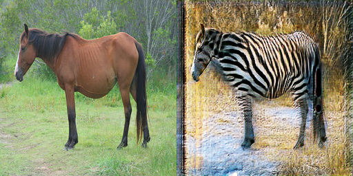
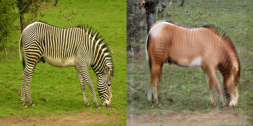
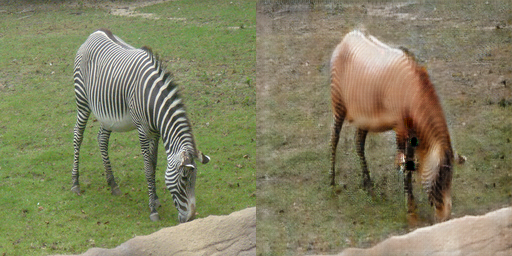
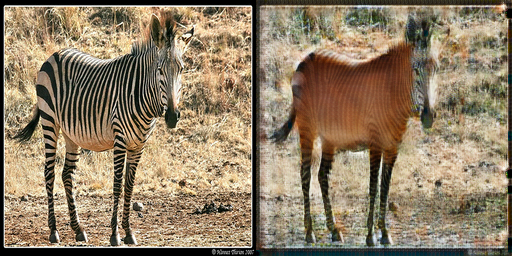

# CycleGAN-tf2
This project implements CycleGAN with tensorflow 2.0

## download dataset

you can train on tensorflow official provided dataset. download dataset with the following command

```python
python3 download_dataset.py
```

## create dataset

also, you can create customized dataset. create two directories "A" and "B" respectively under current directory. put dataset with style A in directory A and ones with style B in directory B. create dataset with the following command

```python
python3 create_dataset.py
```

after executing successfully, you can find two newly created tfrecord file under directory dataset.

## train

train the model with the following command

```python
python3 train.py
```

after the training is completed, use the following command to save the model to h5

my pretrained model is shared [here](https://pan.baidu.com/s/1uTVxi-iHD4SaC6swhCMtIw).

```python
python3 save_model.py
```

## test

test on trained model with the following command

```python
python3 test.py
```

the style translated images of the testset are shown in sequence.

some experimental results of my implement is shown below.

<p align="center">
  <table>
    <caption>horse->zebra</caption>
    <tr>
      <td></td>
      <td></td>
      <td></td>
      <td></td>
    </tr>
    <tr>
      <td></td>
      <td></td>
      <td></td>
      <td></td>
    </tr>
  </table>
  <table>
    <caption>zebra->horse</caption>
    <tr>
      <td></td>
      <td></td>
      <td></td>
      <td></td>
    </tr>
    <tr>
      <td></td>
      <td></td>
      <td></td>
      <td></td>
    </tr>
  </table>
</p>
